# The Definitive Guide to Decision Trees and Gradient Boosting: XGBoost vs LightGBM vs CatBoost

Tree-based models dominate machine learning competitions and real-world applications for structured data. But with multiple frameworks to choose from and dozens of parameters to tune, the landscape can feel overwhelming.

This guide takes you from the fundamentals of a single decision tree all the way through to mastering the three most powerful gradient boosting frameworks. Every concept is accompanied by a visualization generated from real code and real data, so you can see exactly what is happening at each step.

---

## Part 1: Foundations - What Is a Decision Tree?

### The "20 Questions" Mental Model

A decision tree works exactly like the game of 20 Questions. It asks a series of yes/no questions about your data, and each answer leads to either another question or a final prediction.

Consider guessing an animal:

- "Is it a mammal?" - Yes
- "Is it larger than a cat?" - Yes
- "Does it live in water?" - No
- "Does it have stripes?" - Yes
- "Tiger!"

The key insight is that **some questions are better than others**. Asking "Is it a mammal?" splits animals into two meaningful groups. Asking "Does its name start with T?" is nearly useless. Decision trees are algorithms that find the best questions to ask, in the best order.

### Your First Decision Tree

Here is a decision tree trained on a simple 2D classification problem. The left panel shows the tree structure - each box is a node where the tree asks a question about a feature. The right panel shows the resulting decision boundary.

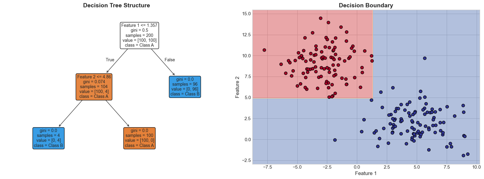

Notice that the decision boundaries are **axis-aligned rectangles**. That is because each split operates on a single feature at a time. Trees cannot draw diagonal boundaries - a limitation that ensemble methods help overcome.

### How Splits Work

At every node, the tree evaluates: "Which question best separates my data?" It needs a mathematical way to measure how "mixed" or "pure" a group of samples is.

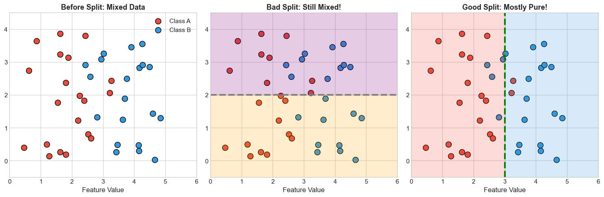

A bad split leaves both regions equally mixed - no useful information gained. A good split creates regions that are mostly pure. The tree evaluates many possible splits and picks the one that creates the purest groups.

### Splitting Criteria: Measuring Purity

#### Gini Impurity (Classification)

The most common measure. Gini impurity answers: "If I randomly pick two samples from this node, how likely are they to be different classes?"

```
Gini = 1 - sum(p_i^2)
```

A Gini of 0 means perfect purity (all samples belong to the same class). A Gini of 0.5 is maximum impurity for binary classification (50/50 split).

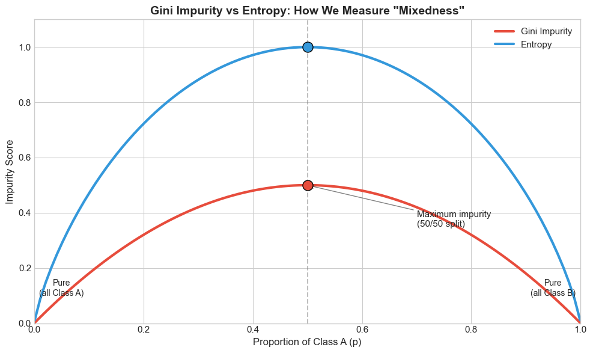

The curve peaks at 50/50 and drops to zero at either extreme. This shape drives the tree to create splits that push child nodes toward the edges - toward purity.

#### Entropy and Information Gain

An alternative from information theory. Entropy measures how many yes/no questions you need to identify a random sample's class:

```
Entropy = -sum(p_i * log2(p_i))
```

When we split, we calculate the **Information Gain** as the parent entropy minus the weighted average of child entropies. The split with the highest gain wins.

#### Mean Squared Error (Regression)

For regression trees, the "impurity" becomes variance - how spread out are the target values? The tree splits to minimize the MSE within each child node.

### The Overfitting Problem

Here is the dark side of decision trees: they are too good at fitting training data. Given enough depth, a tree can create a leaf for every single training sample - achieving 100% training accuracy while learning nothing generalizable.

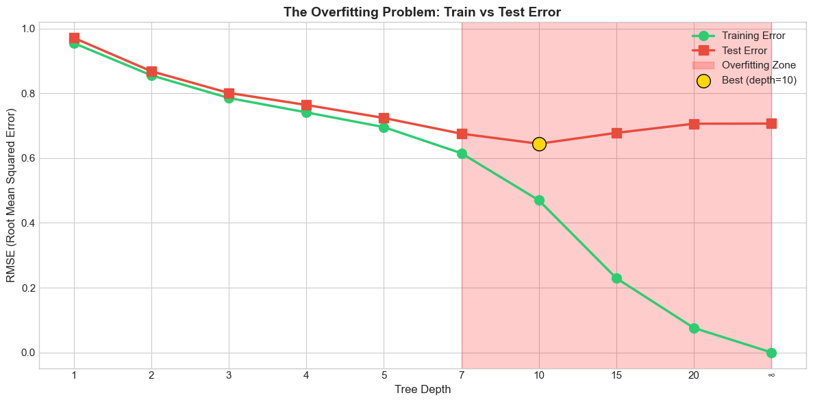

This is the classic overfitting curve. Training error (green) keeps decreasing as trees get deeper, eventually reaching near zero. Test error (red) decreases initially, then increases as the tree becomes too complex. The gap between them is the generalization gap - larger gaps mean more overfitting.

A very deep tree memorizes the training data, including its noise. It becomes a lookup table, not a generalizable model. **This is exactly why ensemble methods were invented.**

---

## Part 2: From One Tree to Many - Ensemble Methods

Single decision trees have a fatal flaw: high variance. Train a tree on slightly different data, and you get a completely different model. The solution is to not rely on one tree, but to use many.

### The Variance Problem

Small changes in training data produce wildly different trees. This instability is the core weakness of individual decision trees.

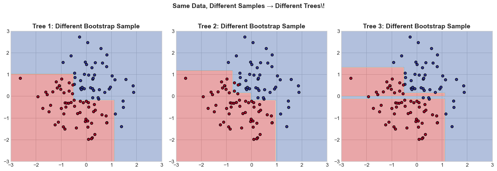

Each panel shows a tree trained on a slightly different subset of the same data. The structures differ dramatically - different features are chosen for splits, different thresholds are used. This is high variance in action.

### The Wisdom of Crowds

The key insight behind ensembles: **averaging many unstable predictions gives a stable result**. Think of asking 100 people to guess how many jellybeans are in a jar. Individual guesses vary wildly, but the average is often remarkably accurate.

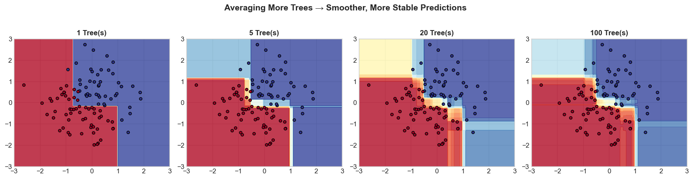

As we average more individual predictions, the combined result becomes increasingly stable. The variance shrinks roughly proportional to 1/N, where N is the number of models.

### Bagging: Bootstrap Aggregating

Bagging is the first ensemble strategy. It works in three steps:

1. **Bootstrap**: Create multiple training sets by sampling with replacement
2. **Train**: Build a tree on each bootstrap sample (in parallel)
3. **Aggregate**: Average predictions (regression) or vote (classification)

Each tree sees slightly different data, so they make different mistakes. Averaging cancels out individual errors.

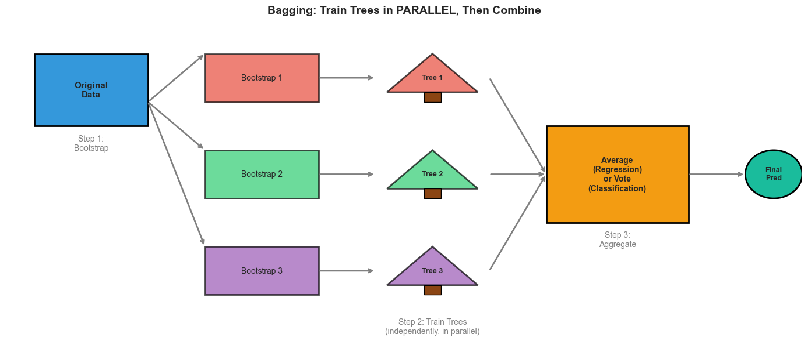

### Random Forests

Random Forests extend bagging with one additional idea: at each split, only consider a **random subset of features**. If one feature is very strong, all trees would use it first, making them too similar. Feature randomization forces diversity, which improves the ensemble.

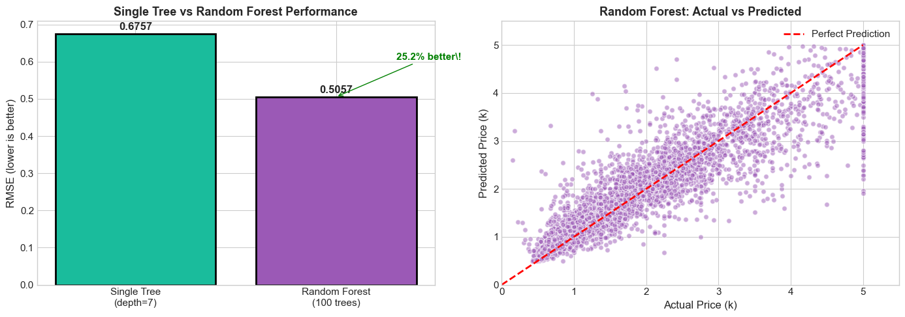

The Random Forest significantly outperforms the single tree. By combining hundreds of diverse trees, we get lower variance without increasing bias.

### Boosting: Sequential Error Correction

Boosting takes a fundamentally different approach from bagging:

| Bagging (Random Forest) | Boosting |
|-------------------------|----------|
| Trees trained in parallel | Trees trained sequentially |
| Each tree is independent | Each tree corrects previous errors |
| Reduces variance | Reduces bias |
| Uses full-depth trees | Uses shallow trees |

The boosting philosophy: each new tree focuses on the mistakes of the previous ensemble.

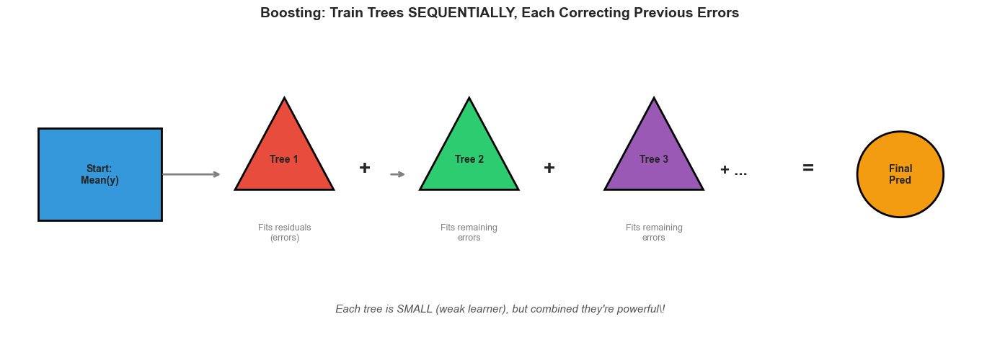

### Gradient Boosting from Scratch

The algorithm is surprisingly simple:

1. **Initialize** with a constant prediction (usually the mean of y)
2. **Calculate residuals**: what the current model gets wrong
3. **Fit a tree** to predict the residuals
4. **Update predictions** by adding the new tree (scaled by a learning rate)
5. **Repeat** steps 2-4 for N iterations


With each iteration, the model gets closer to the true values. The residuals shrink, and the next tree has less to correct. The "gradient" in gradient boosting refers to the fact that residuals are the negative gradient of the MSE loss function. We are doing gradient descent in function space.

---

## Part 3: XGBoost Deep Dive

XGBoost (eXtreme Gradient Boosting) was released in 2014 and quickly became the dominant algorithm for structured data. It won countless competitions and became a go-to tool for data scientists worldwide.

### What Made XGBoost Special

Vanilla gradient boosting existed before XGBoost, but it added several key innovations:

**1. Regularized Objective Function**

XGBoost adds penalties to prevent overfitting. The objective includes both the loss and a regularization term that penalizes tree complexity (number of leaves) and leaf weight magnitudes.

**2. Second-Order Optimization**

Standard gradient boosting only uses the first derivative (gradient) of the loss. XGBoost also uses the second derivative (Hessian), providing information about the curvature of the loss surface. Think of rolling a ball down a hill: the gradient tells you which direction is downhill, but the Hessian tells you how steep and curved the hill is, so you know how far to roll.

**3. Histogram-Based Split Finding**

Finding the best split is expensive - you must sort values and try every possible split point. XGBoost bins continuous features into discrete buckets (typically 256 bins), making split finding dramatically faster with minimal accuracy loss.

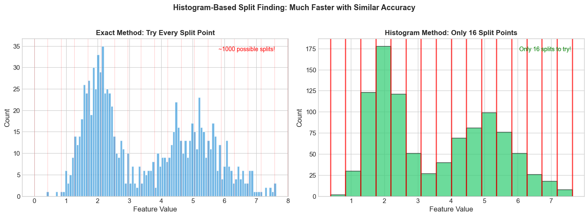

Instead of evaluating thousands of possible thresholds, the algorithm only needs to check boundaries between bins. The accuracy trade-off is negligible because the bins capture the essential distribution.

**4. Built-in Missing Value Handling**

During training, XGBoost learns the optimal direction to send missing values at each split. It tries both directions and picks whichever reduces the loss more. No imputation needed.

**5. Column Subsampling**

Like Random Forests, XGBoost can randomly select a subset of features when building each tree, adding regularization and reducing training time.

### The Learning Rate and Trees Tradeoff

One of the most important relationships in gradient boosting is between learning rate and number of trees. A lower learning rate means each tree contributes less, requiring more trees but typically producing better generalization.

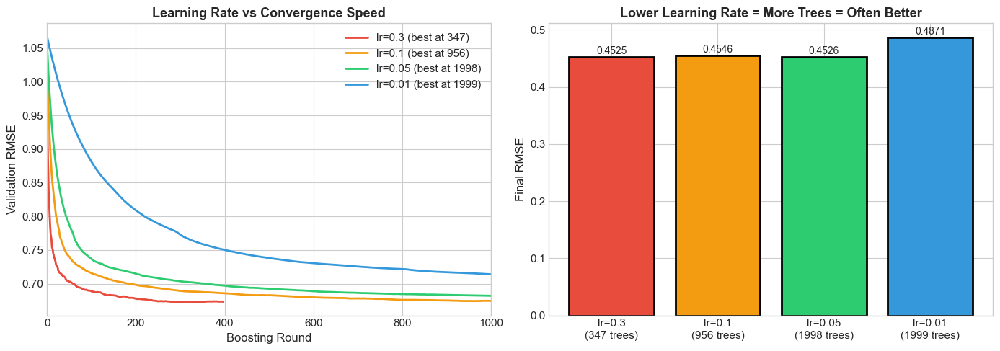

The key takeaway: always use **early stopping** instead of guessing the number of trees. Set a high ceiling for n_estimators and let the validation loss determine when to stop.

### XGBoost in Practice

Here is XGBoost trained on California Housing data with proper early stopping, showing training progress and final predictions:

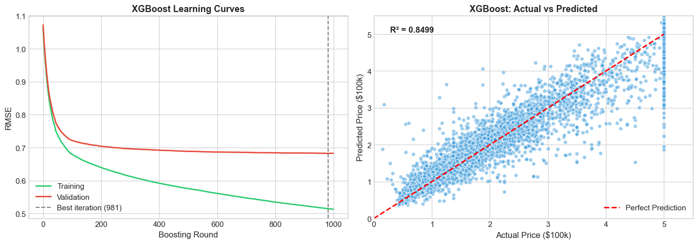

---

## Part 4: LightGBM Deep Dive

LightGBM (Light Gradient Boosting Machine) was released by Microsoft in 2017 with one primary goal: speed. It can train 10-20x faster than XGBoost on large datasets while achieving similar or better accuracy.

### Innovation 1: Leaf-Wise Tree Growth

This is the biggest conceptual difference from XGBoost. XGBoost grows trees level by level (all nodes at depth d before moving to d+1). LightGBM grows trees leaf by leaf, always splitting the leaf with the maximum gain.

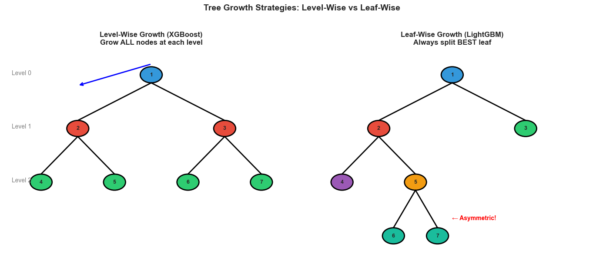

Leaf-wise growth produces more asymmetric trees that converge faster, but carries a higher risk of overfitting - especially on small datasets. This is why `num_leaves` becomes LightGBM's primary complexity control parameter, not `max_depth`.

The rule of thumb: `num_leaves` should be roughly `2^max_depth`. Start with the default of 31 and tune carefully.

### Innovation 2: GOSS (Gradient-based One-Side Sampling)

Traditional boosting uses all samples for each tree. GOSS is a clever sampling trick: keep all samples with large gradients (large errors - these are the most informative), and randomly sample from small-gradient samples (upweighting them to correct the bias).

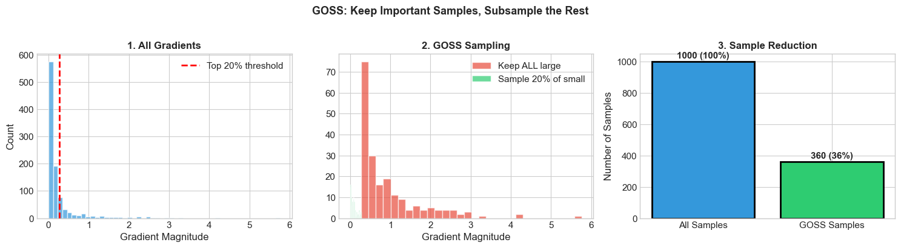

Samples with small gradients are already well-predicted. They contribute less to learning, so we can skip most of them. The result is much faster training with minimal accuracy loss.

### Innovation 3: Exclusive Feature Bundling (EFB)

For high-dimensional sparse data (like one-hot encoded categoricals), many features are mutually exclusive - they are never non-zero at the same time. EFB bundles them into a single feature without losing information. If you one-hot encode "day of week" into 7 features, at most one is ever 1. EFB bundles them back into 1 feature.

### LightGBM vs XGBoost

Here is a direct comparison on the same dataset:

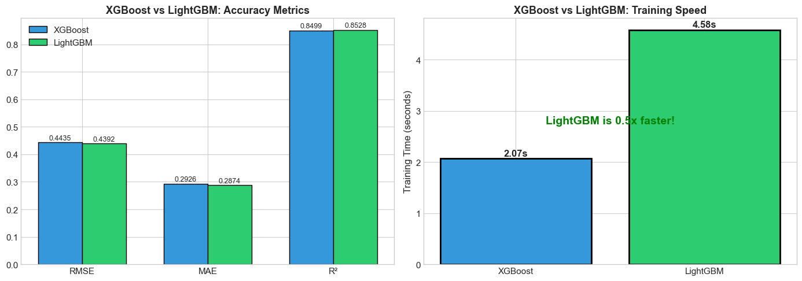

LightGBM typically matches or exceeds XGBoost accuracy while training significantly faster, especially on larger datasets.

---

## Part 5: CatBoost Deep Dive

CatBoost (Categorical Boosting), released by Yandex in 2017, focuses on three innovations: superior categorical feature handling, ordered boosting to reduce overfitting, and symmetric trees for fast inference.

### The Categorical Feature Problem

Most ML models need numeric inputs. The standard approaches for handling categoricals each have drawbacks:

- **One-Hot Encoding** explodes dimensionality for high-cardinality features
- **Label Encoding** implies a false ordering
- **Target Encoding** leaks information and causes overfitting

### Ordered Target Statistics

CatBoost's solution is elegant: for each sample, compute target statistics using only samples that came before it in a random ordering. This prevents the target leakage that plagues naive target encoding.

### Symmetric (Oblivious) Trees

CatBoost uses symmetric trees by default, where all nodes at the same depth use the same split condition. This is structurally different from the asymmetric trees used by XGBoost and LightGBM.

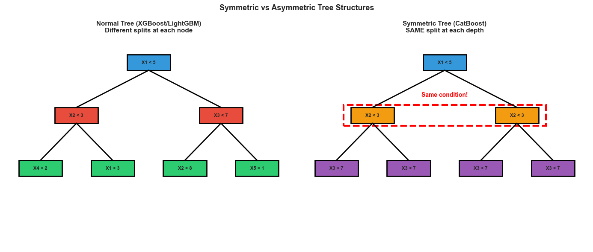

Symmetric trees provide built-in regularization (they cannot create arbitrarily complex splits) and enable extremely fast inference through lookup-table style prediction.

### Three-Way Framework Comparison

Here are all three frameworks compared on the same data:

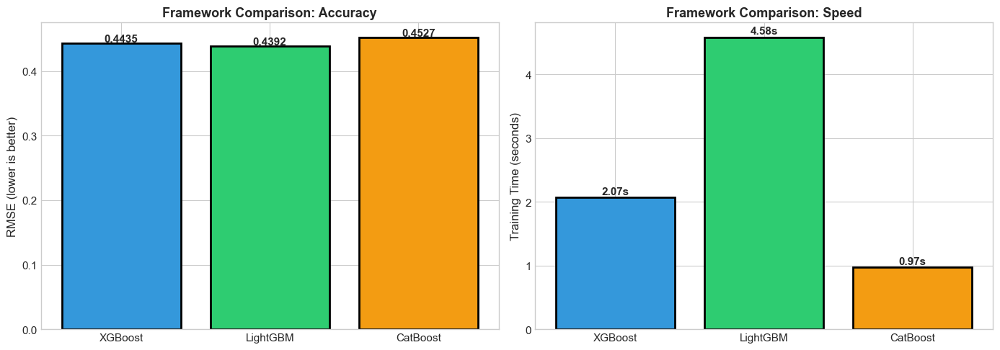

---

## Part 6: The Full Benchmark

A fair head-to-head comparison across all four frameworks (XGBoost, LightGBM, CatBoost, and sklearn's HistGradientBoosting) using the same data and evaluation protocol.

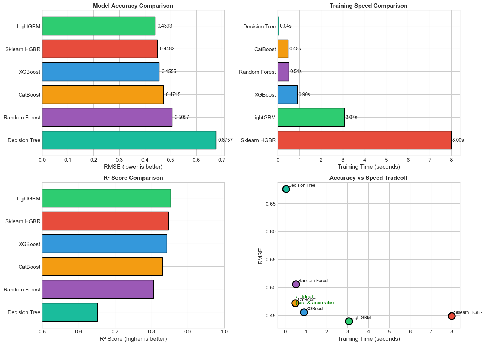

### Which Framework Should You Use?

Here is a practical decision guide:

```
Do you have many categorical features?
  -> CatBoost

Is your dataset very large (>1M rows)?
  -> LightGBM (fastest)

Do you need sklearn pipeline integration?
  -> Sklearn HistGradientBoostingRegressor

Are you iterating quickly and need simplicity?
  -> LightGBM (good defaults)

Default choice
  -> XGBoost (mature, well-documented)
```

In practice, most experienced practitioners start with LightGBM for speed during experimentation, then compare with XGBoost and CatBoost for the final model.

### Architectural Differences at a Glance

| Aspect | XGBoost | LightGBM | CatBoost |
|--------|---------|----------|----------|
| Tree Growth | Level-wise | Leaf-wise | Symmetric |
| Split Finding | Histogram | Histogram + GOSS + EFB | Histogram |
| Categorical Handling | One-hot (default) | Native (good) | Native (best) |
| Missing Values | Learns direction | Learns direction | Learns direction |
| Key Innovation | Regularized objective | Speed optimizations | Ordered boosting |

---

## Part 7: Feature Importance and Explainability

Understanding why a model makes predictions is crucial for trust, debugging, and extracting domain insights.

### Built-in Feature Importance

Tree models natively provide feature importance scores. Split-based importance counts how often a feature is used for splitting. Gain-based importance sums the loss reduction from each feature's splits.

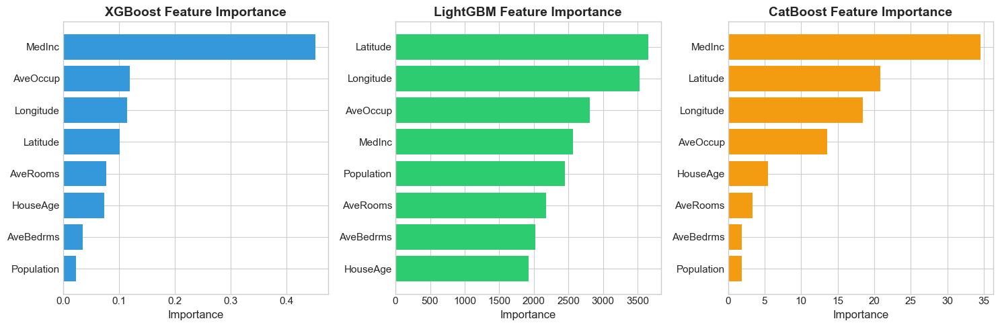

Different frameworks may rank features differently based on their tree-building strategies. This is why it is important to use a model-agnostic method like SHAP for definitive feature importance.

### SHAP Values: The Gold Standard

SHAP (SHapley Additive exPlanations) provides theoretically grounded feature attribution based on game theory. For each prediction, SHAP tells you exactly how much each feature contributed to pushing the prediction away from the average.

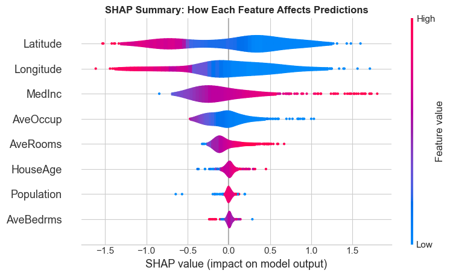

The beeswarm plot shows every sample as a dot. Position along the x-axis indicates the SHAP value (impact on prediction). Color indicates the feature value (red = high, blue = low). This reveals not just which features are important, but how they influence predictions directionally.

### Explaining Individual Predictions

SHAP waterfall plots break down a single prediction, showing exactly which features pushed the price up or down from the baseline.

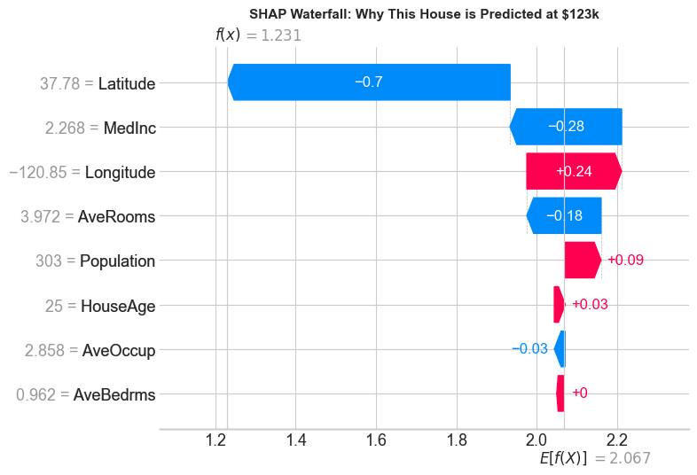

This is invaluable for debugging unexpected predictions and explaining model behavior to stakeholders.

---

## Part 8: Practical Tips and Common Pitfalls

### Starting a New Project

1. Start with LightGBM for the fastest iteration speed
2. Always use early stopping - never hardcode n_estimators
3. Establish a baseline with default parameters
4. Compare frameworks once you have a working pipeline
5. Tune hyperparameters only after validating the overall approach

### Learning Rate and Trees Are Coupled

| Learning Rate | Trees Needed | Quality | Speed |
|---------------|--------------|---------|-------|
| 0.3 | ~100 | Good | Fast |
| 0.1 | ~300 | Better | Medium |
| 0.05 | ~600 | Even better | Slower |
| 0.01 | ~2000+ | Often best | Slow |

Start with 0.1, then try 0.05 and 0.01 with proportionally more trees.

### Reading Learning Curves

| Curve Shape | Diagnosis | Action |
|-------------|-----------|--------|
| Both dropping, small gap | Healthy | Continue training |
| Train dropping, val flat/rising | Overfitting | Reduce complexity, add regularization |
| Both flat and high | Underfitting | Increase complexity |
| Large gap between curves | High variance | Add regularization, more data |

### When NOT to Use Tree-Based Models

| Situation | Better Alternative |
|-----------|--------------------|
| Images, audio, video | Deep learning (CNNs) |
| Text, NLP | Transformers |
| Very high-dimensional sparse data | Linear models |
| Tiny datasets (<100 rows) | Simple models |
| Need smooth/continuous predictions | Neural networks |

### Common Parameter Recipes

**Fast Experimentation**
```python
model = LGBMRegressor(
    n_estimators=100,
    learning_rate=0.1,
    num_leaves=31
)
```

**Production Quality**
```python
model = LGBMRegressor(
    n_estimators=2000,
    learning_rate=0.02,
    num_leaves=63,
    min_child_samples=20,
    subsample=0.8,
    colsample_bytree=0.8,
    reg_alpha=0.1,
    reg_lambda=1.0,
    early_stopping_rounds=100
)
```

**Anti-Overfitting (Small Datasets)**
```python
model = LGBMRegressor(
    n_estimators=1000,
    learning_rate=0.05,
    num_leaves=15,
    min_child_samples=50,
    subsample=0.7,
    colsample_bytree=0.7
)
```

---

## Part 9: Classification Example

To demonstrate that everything applies equally to classification, here is a comparison of all frameworks on the Breast Cancer dataset using ROC curves.

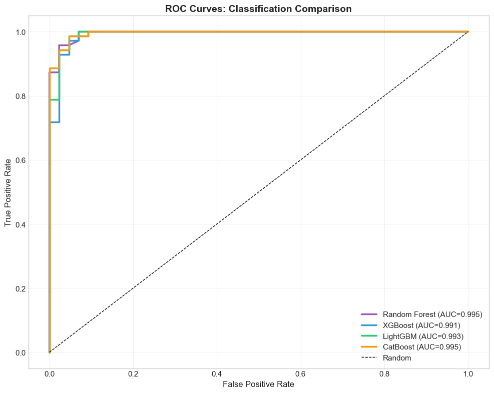

All frameworks achieve excellent AUC scores on this dataset. The differences between them are minimal here, which is typical for well-structured classification problems. The choice of framework matters more when dealing with large datasets, categorical features, or tight computational budgets.

---

## Summary

Tree-based models - from simple decision trees to modern gradient boosting frameworks - form the backbone of applied machine learning for structured data. Here is what to remember:

- **Decision trees** are intuitive but overfit. They are the building block, not the final model.
- **Random Forests** reduce variance through bagging and feature randomization. They are robust and hard to mess up.
- **Gradient boosting** reduces bias by sequentially correcting errors. It requires more careful tuning but typically delivers the best accuracy.
- **XGBoost** brought regularization and engineering excellence. It remains a reliable default choice.
- **LightGBM** optimized for speed with leaf-wise growth and clever sampling. Best for large datasets and fast experimentation.
- **CatBoost** solved the categorical feature problem with ordered target statistics. Best when your data has many categorical columns.

Start simple, use early stopping, tune gradually, and always validate with SHAP that your model is learning the right patterns.

---

## References

- Chen & Guestrin (2016) - [XGBoost: A Scalable Tree Boosting System](https://arxiv.org/abs/1603.02754)
- Ke et al. (2017) - [LightGBM: A Highly Efficient Gradient Boosting Decision Tree](https://papers.nips.cc/paper/6907-lightgbm-a-highly-efficient-gradient-boosting-decision-tree)
- Prokhorenkova et al. (2018) - [CatBoost: Unbiased Boosting with Categorical Features](https://arxiv.org/abs/1706.09516)
- Lundberg & Lee (2017) - [A Unified Approach to Interpreting Model Predictions (SHAP)](https://arxiv.org/abs/1705.07874)

All visualizations generated from the companion [Jupyter notebook](decision_trees_gradient_boosting_guide.ipynb).
